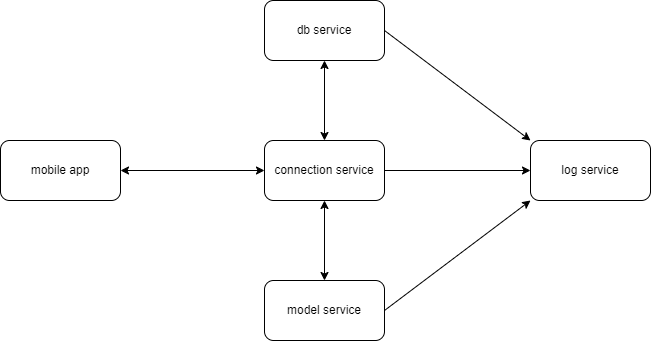

# Nexo Hub

Mobile app for smart devices management.

## Architecture

Kahn process network:



Project consist of:
- [common](./common) - module containing common classes for all services
- [log-service](./log-service) - service collecting other services logs
- [db-service](./db-service) - service wrapping queries to database
- [model-service](./model-service) - service emulating houses with devices and weather
- [connection-service](./connection-service) - service handling user requests
- [load-simulator](./load-simulator) - service emulating users sending requests
- [mobile-app](./mobile-app) - mobile application for smart devices management

## Usage

Start up backend:

```bash
docker-compose up
```

Set mosquitto address in [properties](./mobile-app/src/main/assets/app.properties).

Start mobile app on your phone.
